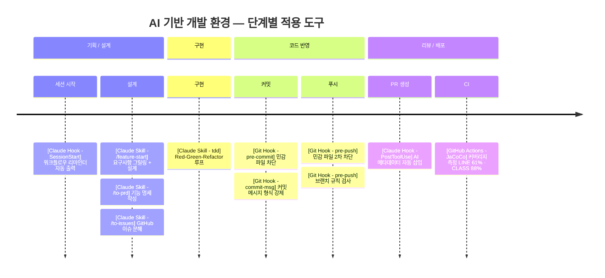

# AI 기반 개발 환경 설계 사례

**프로젝트**: 킬내기 (everyware-ie/kill-betting) — 배틀그라운드 킬내기 세션 점수 자동 계산 서비스  
**기간**: 2026.05 ~  
**역할**: 백엔드 (Java/Spring Boot) + AI 개발 환경 설계  
**관련 PR**: [#69](https://github.com/everyware-ie/kill-betting/pull/69) · [#79](https://github.com/everyware-ie/kill-betting/pull/79) · [#86](https://github.com/everyware-ie/kill-betting/pull/86)

---

AI 도입의 진짜 문제는 AI가 실수한다는 것이 아니다.  
**실수를 예상하지 않고 설계한다는 것이다.**

팀원마다 다른 방식으로 AI를 쓰면, 같은 AI여도 다른 결과가 나온다. 컨텍스트가 다르고, 순서가 다르고, 검증이 없다. 이 프로젝트에서는 그 문제를 개인의 AI 활용 숙련도가 아닌 **팀 인프라 설계**로 풀었다.

---

## 한눈에 보기



---

## AI가 어기는 게 문제가 아니라, 어길 것을 예상하지 않은 것이 문제였다

Claude Code를 팀에 도입하자 두 가지 문제가 반복됐다.

**설계 이탈**: 팀원마다 AI에게 다른 컨텍스트를 전달했다. PRD 없이 구현이 시작됐고, 방향이 어긋난 뒤에야 발견됐다.

**컨벤션 무시**: AI는 빠르게 코드를 생성하지만 팀 규칙을 따르지 않았다. 원격 브랜치 58개 중 19%가 네이밍 규칙 위반이었다. 이건 AI의 문제가 아니었다. AI에게 규칙을 강제하는 장치가 없었던 것이 문제였다.

---

## 지침·실행·검증 3개 레이어로 설계했다

AI를 잘 쓰는 게 목표가 아니었다. **AI가 팀 컨벤션을 벗어나지 못하게 막는 것**이 목표였다.

| 레이어 | 목적 | 수단 |
|--------|------|------|
| **지침 (Instruction)** | AI가 참조하는 컨텍스트를 팀 기준으로 고정 | `CLAUDE.md`, `glossary.md`, 커스텀 스킬 |
| **실행 (Execution)** | AI가 정해진 순서대로 일하도록 강제 | 워크플로우 파이프라인, SessionStart Hook |
| **검증 (Verification)** | AI 출력이 기준을 만족하는지 기계적으로 확인 | Git Hook, JaCoCo, PR 메타데이터 |

---

## 구현

### 0. `[지침 · Instruction]` CLAUDE.md로 AI 컨텍스트를 팀 기준으로 고정했다
> 적용 단계: 전 구간 상시 — AI 세션이 열릴 때마다 로드

AI 출력의 품질은 AI가 읽는 지침의 품질에 비례한다. `CLAUDE.md`를 팀 공용 AI 지침서로 운영하고, git으로 버전 관리해 지침 변화 이력을 추적했다.

- **`CLAUDE.md`**: 작업 유형별 참조 파일, 도메인 용어, 워크플로우 순서를 명시한다. 팀원 모두에게 동일하게 로드한다.
- **`glossary.md`**: 도메인 용어를 고정해 AI가 코드·커밋·문서에서 표현을 바꾸지 못하도록 차단한다.
- **`docs-convention.md`**: 코드 변경 유형별로 어떤 문서를 업데이트해야 하는지 트리거를 정의한다. AI가 구현 후 문서를 빠뜨리지 않도록 강제한다.
- **11개 → 3개 통합**: 산재된 문서를 `architecture.md`, `layers.md`, `tests.md`로 통합해 AI가 참조하는 컨텍스트 크기와 중복을 줄였다.

---

### 1. `[실행 · Execution]` 4단계 워크플로우로 AI 작업 순서를 강제했다
> 적용 단계: 기획/설계 → 구현

AI에게 맥락 없이 구현을 시키면 PRD 없이 코드가 먼저 나온다. 기획부터 구현까지 단계를 강제하는 파이프라인을 설계하고, 각 단계를 Claude Code 커스텀 스킬로 구현했다.

```
/feature-start  →  /to-prd  →  /to-issues  →  tdd
   요구사항            PRD          GitHub         구현
   그릴링 + 설계       정리         이슈 분해
```

| 스킬 | 역할 |
|------|------|
| `/feature-start` | 요구사항 인터뷰(그릴링) + 설계 워크숍을 한 세션에 진행 |
| `/to-prd` | 대화 내용을 구조화된 PRD 문서로 변환 |
| `/to-issues` | PRD를 독립 실행 가능한 GitHub 이슈로 분해 |
| `tdd` | Red-Green-Refactor 루프 가이드 |
| `grilling` | 계획·설계의 가정을 집요하게 검증 |
| `domain-modeling` | 도메인 용어 정제 및 `glossary.md` 동기화 |

`SessionStart` 훅을 추가해 Claude Code를 열 때마다 워크플로우를 자동으로 출력한다. 호출을 기억해야 하는 구조에서 벗어나, 매 세션마다 순서가 자동으로 제시된다.

```json
"SessionStart": [{
  "command": "echo '{\"systemMessage\":\"[킬내기] 새 기능을 시작하나요? 반드시 /feature-start → /to-prd → /to-issues 순서로 진행하세요.\"}'
"}]
```

---

### 2. `[검증 · Verification]` Git Hook으로 AI 출력을 커밋·푸시 시점에 차단했다
> 적용 단계: 코드 반영

CI가 위반을 잡는 시점은 push 이후다. 위반이 원격에 올라가기 전, 로컬에서 먼저 막는 게 목표였다. `sh scripts/hooks/install.sh` 한 줄로 팀 전원이 설치한다.

| Hook | 동작 |
|------|------|
| `pre-commit` | `.env`, `*.pem`, `application-local.yml` 등 민감 파일 커밋 차단 |
| `commit-msg` | `type(scope): 설명` 형식 미준수 시 커밋 차단 |
| `pre-push` | 민감 파일 2차 차단 (`--no-verify` 우회 대응) + 브랜치 네이밍 위반 시 push 차단 |

`pre-commit`을 `--no-verify`로 우회해도 `pre-push`가 push 대상 커밋 전체를 재스캔한다. AI가 훅을 건너뛰더라도 원격에 올라가지 못한다.

JaCoCo를 CI에 추가해 빌드마다 커버리지 리포트를 artifact로 업로드했다.

```
LINE: 61.0%  |  BRANCH: 38.7%  |  METHOD: 67.2%  |  CLASS: 88.6%
```

---

### 3. `[검증 · Verification]` PR마다 AI 사용 이력을 자동으로 기록했다
> 적용 단계: 리뷰/배포

리뷰어는 코드가 AI 작성인지 모른 채 리뷰한다. AI 관여 수준이 드러나지 않으면 리뷰 강도를 조절할 수 없다. `gh pr create` 시 `PostToolUse` 훅이 세션 통계를 파싱해 PR 본문에 자동 삽입한다.

```bash
STATS=$(python3 scripts/ai-session-stats.py)
gh pr edit "$PR_NUMBER" --body "${CURRENT_BODY}\n${STATS}"
```

실제 캡처된 artifact (PR #86):

```
모델              claude-sonnet-4-6
워크플로우        /feature-start ✅  /to-prd ❌(예외 조항 적용)
세션 시간         07:47 → 09:39 (약 1시간 52분)
턴 수             188회
생성 토큰         120,349
컨텍스트 캐시 히트 16,040,827
```

이 기록으로 워크플로우 준수 여부, 세션 길이, 사용 모델을 PR 단위로 감사한다.

---

## 스킬만으로는 부족했다 — 측정하고 반복했다

**① 케이스별 자율 호출 스킬은 실제로 쓰이지 않았다**  
`acceptance-test`, `frontend-develop`, `test-conventions` 같이 "상황에 맞게 직접 골라 쓰는" 스킬들은 채택률이 낮았다. 개발자가 매번 스킬을 골라 호출해야 하는 구조였기 때문이다.  
반면 `/feature-start → /to-prd → /to-issues` 파이프라인은 워크플로우 자체가 순서를 정해주고, `SessionStart` 훅이 매 세션마다 리마인더를 출력해 별도 판단 없이 따르게 됐다.  
→ 자율 호출 스킬들은 `legacy/`로 이동했다. **스킬은 워크플로우에 묶여야 실제로 쓰인다.**

**② 초기 CLAUDE.md가 너무 추상적이었다**  
"컨벤션을 따르라"는 수준의 지침은 AI에게 아무 효과가 없었다. 실제 관찰한 위반 패턴:
- scope 규칙 불명확 → AI가 scope을 파일명으로 쓰거나 생략
- 메서드 길이, Tell Don't Ask, import 규칙 등 구체적 기준 부재
- 도메인 용어가 코드·커밋·문서에서 제각각 표현됨

→ 11개 문서를 3개로 통합·구체화했다. `glossary.md`로 용어를 고정했다. 커밋 직전 `git.md`를 자동 주입하는 `PreToolUse` 훅을 추가했다.

**③ 개선 전 실측값 (PR #69 기준)**

| 항목 | 측정값 |
|------|--------|
| 브랜치 네이밍 위반 (원격 58개) | 11건 (19%) |
| 커밋 컨벤션 위반 (최근 100건) | 3건 (5%) |
| 민감 파일 git 추적 여부 | 없음 |

수치를 먼저 측정하고 Hook을 도입한 뒤 차단 효과를 검증했다.

---

## 도입 후 달라진 것

| 항목 | 변화 |
|------|------|
| 브랜치 네이밍 위반 | 19% → Hook 도입 후 push 단계에서 차단 |
| 커밋 컨벤션 위반 | 5% → commit-msg Hook으로 커밋 시점 차단 |
| 민감 파일 유출 위험 | pre-commit + pre-push 이중 차단 |
| 코드 커버리지 | 측정 불가 → LINE 61% (CI artifact로 매 빌드 관측) |
| AI 세션 투명성 | 불명 → PR마다 모델·시간·턴수·토큰 기록 |

---

## 이 경험에서 얻은 것

AI를 도입하는 것보다 **AI가 팀 컨벤션 안에서 동작하게 만드는 것**이 더 어렵다. 지침이 구체적이지 않으면 AI는 임의로 결정하고, 검증이 없으면 위반이 쌓인다.

이 프로젝트에서 배운 것은 하나다.

> AI를 믿고 쓰는 것과, AI가 실수할 것을 예상하고 시스템을 설계하는 것은 다르다.

채용 요건에 "AI 활용 경험"이 있다면, 활용 자체보다 **AI를 어떻게 제어했는가**가 팀에 실제로 기여할 수 있는 역량이다.
