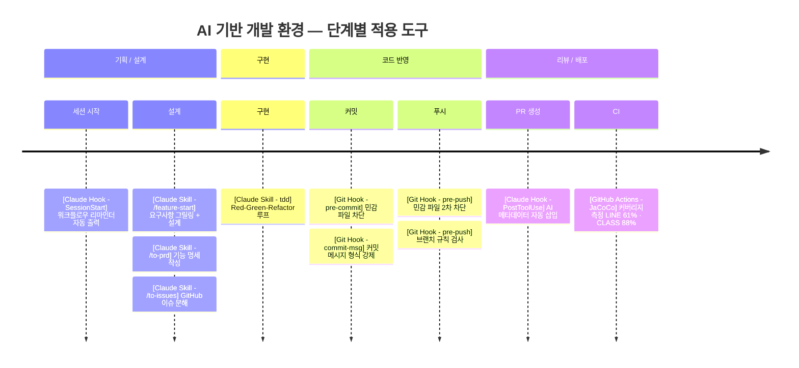

# AI 기반 개발 환경 설계 사례

**프로젝트**: 킬내기 (everyware-ie/kill-betting) — 배틀그라운드 킬내기 세션 점수 자동 계산 서비스  
**기간**: 2026.05 ~  
**역할**: 백엔드 (Java/Spring Boot) + AI 개발 환경 설계  
**관련 PR**: [#69](https://github.com/everyware-ie/kill-betting/pull/69) · [#79](https://github.com/everyware-ie/kill-betting/pull/79) · [#86](https://github.com/everyware-ie/kill-betting/pull/86)

---

## 한눈에 보기



---

## 문제

팀이 Claude Code(AI 코딩 에이전트)를 활용하기 시작하면서 두 가지 구조적 문제가 생겼다.

1. **설계 이탈**: AI에게 컨텍스트를 다르게 전달하다 보니 PRD 없이 구현이 시작되고, 나중에 방향이 어긋난 뒤에야 발견됐다.
2. **품질 회귀**: AI가 코드를 빠르게 생성하지만, 커밋 메시지·브랜치 네이밍 같은 팀 컨벤션은 무시됐다. 측정 결과, 원격 브랜치 58개 중 19%(11건)가 네이밍 규칙 위반이었다.

---

## 접근 방식

단순히 AI를 사용하는 것이 아니라 **AI의 행동을 통제하고 출력을 검증 가능하게 만드는 것**이 목표였다. 3개 레이어로 설계했다.

| 레이어 | 목적 | 수단 |
|--------|------|------|
| **지침 (Instruction)** | AI가 참조하는 컨텍스트를 팀 기준으로 고정 | `CLAUDE.md`, `glossary.md`, 커스텀 스킬 |
| **실행 (Execution)** | AI가 정해진 순서대로 일하도록 강제 | 워크플로우 파이프라인, SessionStart Hook |
| **검증 (Verification)** | AI 출력이 기준을 만족하는지 기계적으로 확인 | Git Hook, JaCoCo, PR 메타데이터 |

---

## 구현

### 0. 지침 파일(Instruction) 관리 (PR #86)

AI 출력의 품질은 AI가 읽는 지침의 품질에 비례한다. `CLAUDE.md`를 팀 공용 AI 지침서로 운영하고, git으로 버전 관리해 지침의 변화 이력을 추적했다.

- **`CLAUDE.md`**: 작업 유형별로 참조할 파일, 도메인 용어, 워크플로우 순서를 명시. 팀원 모두의 AI 세션에 동일하게 로드된다.
- **`glossary.md`**: 도메인 용어를 고정해 AI가 코드·커밋·문서에서 다른 표현을 쓰지 못하도록 차단.
- **`docs-convention.md`**: 코드 변경 유형별로 어떤 문서를 업데이트해야 하는지 트리거를 정의. AI가 구현 후 문서를 빠뜨리지 않도록 강제.
- **11개 → 3개 통합**: 산재된 문서를 `architecture.md`, `layers.md`, `tests.md`로 통합해 AI가 참조하는 컨텍스트 크기와 중복을 줄였다.

---

### 1. AI 워크플로우 파이프라인 (PR #79)

기능 구현의 시작부터 끝까지 AI가 역할을 갖는 4단계 파이프라인을 설계하고, 각 단계를 Claude Code **커스텀 스킬**로 구현했다.

```
/feature-start  →  /to-prd  →  /to-issues  →  tdd
   요구사항            PRD          GitHub         구현
   그릴링 + 설계       정리         이슈 분해
```

| 스킬 | 역할 |
|------|------|
| `/feature-start` | 요구사항 인터뷰(그릴링) + 설계 워크숍을 한 세션에 진행 |
| `/to-prd` | 대화 내용을 구조화된 PRD 문서로 변환 |
| `/to-issues` | PRD를 독립 실행 가능한 GitHub 이슈로 분해 |
| `tdd` | Red-Green-Refactor 루프 가이드 |
| `/improve-codebase-architecture` | 주기적 코드 구조 스캔 + HTML 리포트 |
| `grilling` | 계획·설계의 가정을 집요하게 검증 |
| `domain-modeling` | 도메인 용어 정제 및 용어집(`glossary.md`) 동기화 |

**세션 시작 자동 리마인더** (`.claude/settings.json`):  
Claude Code를 열 때마다 자동으로 워크플로우 가이드를 출력해 PRD 없이 구현이 시작되지 않도록 강제했다.

```json
"SessionStart": [{
  "command": "echo '{\"systemMessage\":\"[킬내기] 새 기능을 시작하나요? 반드시 /feature-start → /to-prd → /to-issues 순서로 진행하세요.\"}'
"}]
```

---

### 2. 자동 가드레일 (PR #69)

AI 보조 개발 환경에서 코드 검토가 충분하지 않아도 기본 품질과 보안이 유지되도록 3개 Git Hook과 커버리지 측정을 추가했다.

| Hook | 동작 |
|------|------|
| `pre-commit` | `.env`, `*.pem`, `application-local.yml` 등 민감 파일 커밋 차단 |
| `commit-msg` | `type(scope): 설명` 형식 미준수 시 커밋 자체를 차단 |
| `pre-push` | 브랜치 네이밍 규칙 위반(닉네임 오류, `feat` → `feature` 등) 시 push 차단 |

팀 설치는 `sh scripts/hooks/install.sh` 한 줄로 통일했다.

**JaCoCo 커버리지 측정**: CI 빌드마다 리포트를 artifact로 업로드해 커버리지를 관측 가능 상태로 만들었다.

```
LINE: 61.0%  |  BRANCH: 38.7%  |  METHOD: 67.2%  |  CLASS: 88.6%
```

---

### 3. 검증 Artifact 캡처 (PR #86, 현재 브랜치)

AI가 관여한 PR마다 검증 가능한 artifact를 남겨 "AI가 어떻게 쓰였는지"를 사후에 감사(audit)할 수 있도록 했다.

**PR 메타데이터 자동 기록**: `gh pr create` 시 `PostToolUse` 훅이 세션 통계를 파싱해 PR 본문에 자동 삽입한다.

```bash
# scripts/ai-session-stats.py → JSONL 파싱 → 표 생성
STATS=$(python3 scripts/ai-session-stats.py)
gh pr edit "$PR_NUMBER" --body "${CURRENT_BODY}\n${STATS}"
```

실제 캡처된 artifact 예시 (PR #86):

```
모델              claude-sonnet-4-6
워크플로우        /feature-start ✅  /to-prd ❌(예외 조항 적용)
세션 시간         07:47 → 09:39 (약 1시간 52분)
턴 수             188회
생성 토큰         120,349
컨텍스트 캐시 히트 16,040,827
```

이 데이터로 "워크플로우를 지켰는가", "세션이 얼마나 길었는가", "어떤 모델을 썼는가"를 PR 단위로 추적한다.

---

## 개선 과정 — 측정하고 반복했다

초기 도입 후 실제 개발에서 관찰한 문제들이다. 이 문제들이 각 개선 작업의 출발점이 됐다.

**① 스킬 채택률 저조**
`/feature-start → /to-prd → /to-issues` 순서를 따르지 않고 바로 구현을 시작하는 케이스가 반복됐다. 스킬이 존재해도 팀원이 매번 기억해서 호출해야 하는 구조라 실제 사용률이 낮았다. → `SessionStart` 훅으로 세션 시작 시 워크플로우를 강제 출력하도록 개선.

**② 초기 컨벤션이 너무 추상적**
초기 CLAUDE.md는 "컨벤션을 따르라"는 수준이었고, AI가 자주 어겼다.
- 커밋 scope 규칙이 불명확 → AI가 scope을 파일명으로 쓰거나 생략
- 메서드 길이, Tell Don't Ask, import 규칙 등 구체적 기준 부재
- 도메인 용어가 코드·커밋·문서에서 제각각 표현됨

→ PR #86에서 11개 산재 문서를 3개로 통합·구체화. `glossary.md`로 용어 고정. 커밋 직전 `git.md`를 자동 주입하는 `PreToolUse` 훅 추가.

**③ AI 컨벤션 위반을 사전에 측정했다**
개선 전 실측값 (PR #69 기준):

| 항목 | 측정값 |
|------|--------|
| 브랜치 네이밍 위반 (원격 58개) | 11건 (19%) |
| 커밋 컨벤션 위반 (최근 100건) | 3건 (5%) |
| 민감 파일 git 추적 | 없음 (측정 불가) |

수치를 먼저 잡은 뒤 Hook을 도입해 차단 효과를 검증했다.

---

## 성과

| 항목 | 수치 |
|------|------|
| 브랜치 네이밍 위반 (58개 기준) | 19% → Hook 도입 후 차단 |
| 커밋 컨벤션 위반 (최근 100건) | 5%(3건) → Hook 도입 후 차단 |
| 코드 커버리지 (LINE) | 측정 전 불명 → 61% (CI artifact로 관측 가능) |
| PRD 없이 구현 시작 | 반복 발생 → 세션 시작 리마인더 + 워크플로우 강제 |
| AI 세션 투명성 | 불명 → PR마다 모델·시간·토큰 수 기록 |

---

## 기술 선택 이유

- **`CLAUDE.md` + `glossary.md`를 git으로 관리**: AI 지침도 코드처럼 버전 관리해야 한다. 지침이 바뀔 때마다 커밋 히스토리가 남고, 어떤 세션에서 무엇이 달라졌는지 추적 가능하다.
- **커스텀 스킬로 프롬프트 고정**: 프롬프트를 매번 자유롭게 쓰면 팀원마다 AI 행동이 달라진다. 스킬로 캡슐화해 "같은 입력 → 같은 프로세스"를 보장한다.
- **Git Hook (클라이언트 사이드)**: CI가 잡기 전에 로컬에서 먼저 차단. AI가 `--no-verify` 없이 커밋하는 한 우회 불가능한 검증 게이트가 된다.
- **PR 검증 artifact**: "AI가 썼다"는 사실보다 "어떤 워크플로우로, 얼마나, 어떤 모델로 썼는지"를 기록하는 것이 핵심이다. 리뷰어가 AI 관여 수준을 보고 리뷰 강도를 조절할 수 있다.