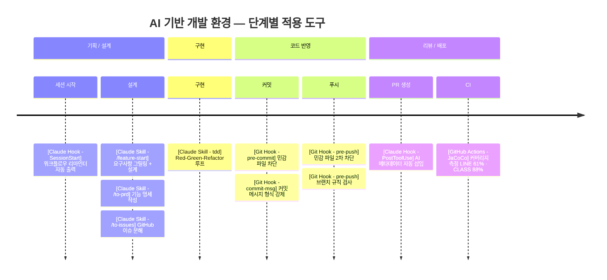

# AI 기반 개발 환경 설계 사례

**프로젝트**: 킬내기 (everyware-ie/kill-betting) — 배틀그라운드 킬내기 세션 점수 자동 계산 서비스  
**기간**: 2026.05 ~  
**역할**: 백엔드 (Java/Spring Boot) + AI 개발 환경 설계  
**관련 PR**: [#69](https://github.com/everyware-ie/kill-betting/pull/69) · [#79](https://github.com/everyware-ie/kill-betting/pull/79) · [#86](https://github.com/everyware-ie/kill-betting/pull/86)

---

## 한눈에 보기



---

## 문제

팀이 Claude Code(AI 코딩 에이전트)를 활용하기 시작하면서 두 가지 구조적 문제가 생겼다.

1. **설계 이탈**: AI에게 컨텍스트를 다르게 전달하다 보니 PRD 없이 구현이 시작되고, 나중에 방향이 어긋난 뒤에야 발견됐다.
2. **품질 회귀**: AI가 코드를 빠르게 생성하지만, 커밋 메시지·브랜치 네이밍 같은 팀 컨벤션은 무시됐다. 측정 결과, 원격 브랜치 58개 중 19%(11건)가 네이밍 규칙 위반이었다.

---

## 접근 방식

AI를 개인 툴이 아닌 **팀 개발 인프라**로 보고 두 축으로 대응했다.

- **워크플로우 표준화**: AI와 함께 일하는 단계별 파이프라인 설계
- **자동 가드레일**: AI 생성 코드가 컨벤션을 벗어나지 못하도록 기계적으로 차단

---

## 구현

### 1. AI 워크플로우 파이프라인 (PR #79)

기능 구현의 시작부터 끝까지 AI가 역할을 갖는 4단계 파이프라인을 설계하고, 각 단계를 Claude Code **커스텀 스킬**로 구현했다.

```
/feature-start  →  /to-prd  →  /to-issues  →  tdd
   요구사항            PRD          GitHub         구현
   그릴링 + 설계       정리         이슈 분해
```

| 스킬 | 역할 |
|------|------|
| `/feature-start` | 요구사항 인터뷰(그릴링) + 설계 워크숍을 한 세션에 진행 |
| `/to-prd` | 대화 내용을 구조화된 PRD 문서로 변환 |
| `/to-issues` | PRD를 독립 실행 가능한 GitHub 이슈로 분해 |
| `tdd` | Red-Green-Refactor 루프 가이드 |
| `/improve-codebase-architecture` | 주기적 코드 구조 스캔 + HTML 리포트 |
| `grilling` | 계획·설계의 가정을 집요하게 검증 |
| `domain-modeling` | 도메인 용어 정제 및 용어집(`glossary.md`) 동기화 |

**세션 시작 자동 리마인더** (`.claude/settings.json`):  
Claude Code를 열 때마다 자동으로 워크플로우 가이드를 출력해 PRD 없이 구현이 시작되지 않도록 강제했다.

```json
"SessionStart": [{
  "command": "echo '{\"systemMessage\":\"[킬내기] 새 기능을 시작하나요? 반드시 /feature-start → /to-prd → /to-issues 순서로 진행하세요.\"}'
"}]
```

---

### 2. 자동 가드레일 (PR #69)

AI 보조 개발 환경에서 코드 검토가 충분하지 않아도 기본 품질과 보안이 유지되도록 3개 Git Hook과 커버리지 측정을 추가했다.

| Hook | 동작 |
|------|------|
| `pre-commit` | `.env`, `*.pem`, `application-local.yml` 등 민감 파일 커밋 차단 |
| `commit-msg` | `type(scope): 설명` 형식 미준수 시 커밋 자체를 차단 |
| `pre-push` | 브랜치 네이밍 규칙 위반(닉네임 오류, `feat` → `feature` 등) 시 push 차단 |

팀 설치는 `sh scripts/hooks/install.sh` 한 줄로 통일했다.

**JaCoCo 커버리지 측정**: CI 빌드마다 리포트를 artifact로 업로드해 커버리지를 관측 가능 상태로 만들었다.

```
LINE: 61.0%  |  BRANCH: 38.7%  |  METHOD: 67.2%  |  CLASS: 88.6%
```

---

### 3. AI 사용 현황 추적 (PR #86, 현재 브랜치)

**PR 템플릿**에 AI 메타데이터 섹션을 추가해, AI가 얼마나 관여했는지를 PR 자체에 기록한다.

```
| 항목 | 값 |
|------|-----|
| 모델 | claude-sonnet-4-6 |
| 워크플로우 | /feature-start ✅ | /to-prd ✅ | /to-issues ✅ |
| 세션 시간 | 07:47 → 09:39 (약 1시간 52분) |
| 턴 수 | 188회 |
| 생성 토큰 | 120,349 |
| 컨텍스트 캐시 히트 | 16,040,827 |
```

**자동 삽입 스크립트 + Hook**: `gh pr create` 실행 시 현재 세션의 AI 메타데이터를 파싱해 PR 본문에 자동으로 추가한다.

```bash
# PostToolUse Hook — gh pr create 감지 후 자동 실행
STATS=$(python3 scripts/ai-session-stats.py)
gh pr edit "$PR_NUMBER" --body "${CURRENT_BODY}\n${STATS}"
```

---

## 성과

| 항목 | 수치 |
|------|------|
| 브랜치 네이밍 위반 (58개 기준) | 19% → Hook 도입 후 차단 |
| 커밋 컨벤션 위반 (최근 100건) | 5%(3건) → Hook 도입 후 차단 |
| 코드 커버리지 (LINE) | 측정 전 불명 → 61% (CI artifact로 관측 가능) |
| PRD 없이 구현 시작 | 반복 발생 → 세션 시작 리마인더 + 워크플로우 강제 |
| AI 세션 투명성 | 불명 → PR마다 모델·시간·토큰 수 기록 |

---

## 기술 선택 이유

- **Claude Code 커스텀 스킬**: AI의 행동을 팀 컨벤션에 맞게 고정하기 위해. 프롬프트를 매번 직접 쓰면 사람마다 달라지는 문제를 해결함.
- **Git Hook (서버 사이드 X, 클라이언트 사이드 O)**: CI가 잡기 전에 로컬에서 먼저 차단. 불필요한 push → fail 사이클을 없앰.
- **PR 메타데이터 템플릿**: AI 관여도를 코드 리뷰 시점에 명시적으로 드러내기 위해. "이 코드 AI가 짠 거야?"를 암묵적으로 두지 않고 투명하게 공개.